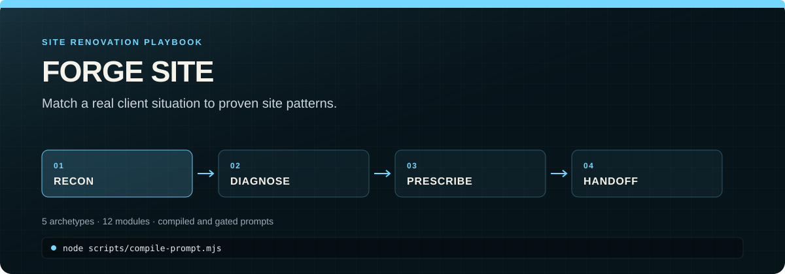

<p align="center">
  
</p>

# forge-site

A blueprint system for agent-driven client site builds. Codifies a repeatable "renovation" process — from discovery through deployed handoff — using proven archetypes, battle-tested modules, and the forge family toolchain.

## What This Is

forge-site is a **knowledge artifact**. No runtime, no database, no build step — structured documentation that humans and AI agents consume to build client sites from proven patterns. The one helper script, `scripts/compile-prompt.mjs`, fills a generation prompt's mechanical slots from a brand-kit and gates filled prompts; everything else is read, not executed.

Think Kitchen Nightmares, not Shopify. You walk into a client's situation, diagnose what they need, select from proven modules, and agents build it using patterns extracted from real shipped projects.

## Project Structure

```
forge-site/
├── archetypes/          # 5 business pattern definitions (+ *.DESIGN.md design layer)
│   ├── service-business.md
│   ├── event-organizer.md
│   ├── digital-content.md
│   ├── portfolio-brand.md
│   └── publication.md
│
├── modules/             # 12 proven integration patterns
│   ├── payments-stripe.md
│   ├── auth-clerk.md
│   ├── cms-sanity.md
│   └── ...
│
├── playbook/            # 5-step delivery process
│   ├── 1-recon.md       # Discovery + audit
│   ├── 2-diagnose.md    # Client → archetype matching
│   ├── 3-prescribe.md   # Module selection
│   ├── 4-renovate.md    # Agent execution workflow
│   └── 5-handoff.md     # Client receives + operates
│
├── templates/           # Spec templates + compiled-prompt scaffolds
│   ├── service-business.yml
│   ├── event-organizer.yml
│   ├── digital-content.yml
│   ├── portfolio-brand.yml
│   ├── publication.yml
│   ├── site-generation-prompt.md    # greenfield builds
│   └── site-remediation-prompt.md   # fixing existing sites
│
├── scripts/
│   └── compile-prompt.mjs  # fill prompt slots from brand-kit; gate filled prompts
│
└── specchain/           # Specchain config for forge-site itself
```

## Archetypes

Extracted from real shipped projects in this workspace:

| Archetype | What it serves | Reference projects |
|-----------|---------------|-------------------|
| **Service Business** | Local providers needing web presence + leads | Allen Wellness Center, Creative Floors |
| **Event Organizer** | Selling registrations, managing live events | Volley Rx, Let's Pepper, Rally HQ |
| **Digital Content** | Selling access to videos, courses, downloads | Rally HQ (billing), Urvil Performance |
| **Portfolio/Brand** | Personal or business brand with media focus | Photography, website-nc, FlickDay |
| **Publication** | Free, ungated editorial publication under one voice | Signal Dispatch v1/v2 |

## The Forge Family

forge-site orchestrates existing tools in the `tools/` directory:

| Tool | Role |
|------|------|
| **specchain** | Defines the work (requirements → spec → tasks) |
| **brand-forge** | Creates brand identity (colors, typography, media templates) |
| **signal-forge** | Creates site copy and content |
| **image-gen** | Creates hero images, social cards, media assets |
| **claude-docs-toolkit** | Generates handoff documentation |
| **forge-site** | Connects all of the above via archetypes + modules + playbook |

## Usage

1. Read `playbook/1-recon.md` — run discovery with the client
2. Read `playbook/2-diagnose.md` — match client to an archetype
3. Read `playbook/3-prescribe.md` — select modules
4. Copy the matching `templates/*.yml` into a new project's specchain
5. Customize the template with client-specific details
6. Run `/new-spec` → `/create-spec` → `/implement-spec` in the new project
7. Follow `playbook/5-handoff.md` to deliver

## Origin

This system was extracted from analyzing ~15 projects across `apps/`, `clients/`, and `tools/` directories. Every archetype maps to real shipped work. Every module references real production code. Nothing is theoretical.
